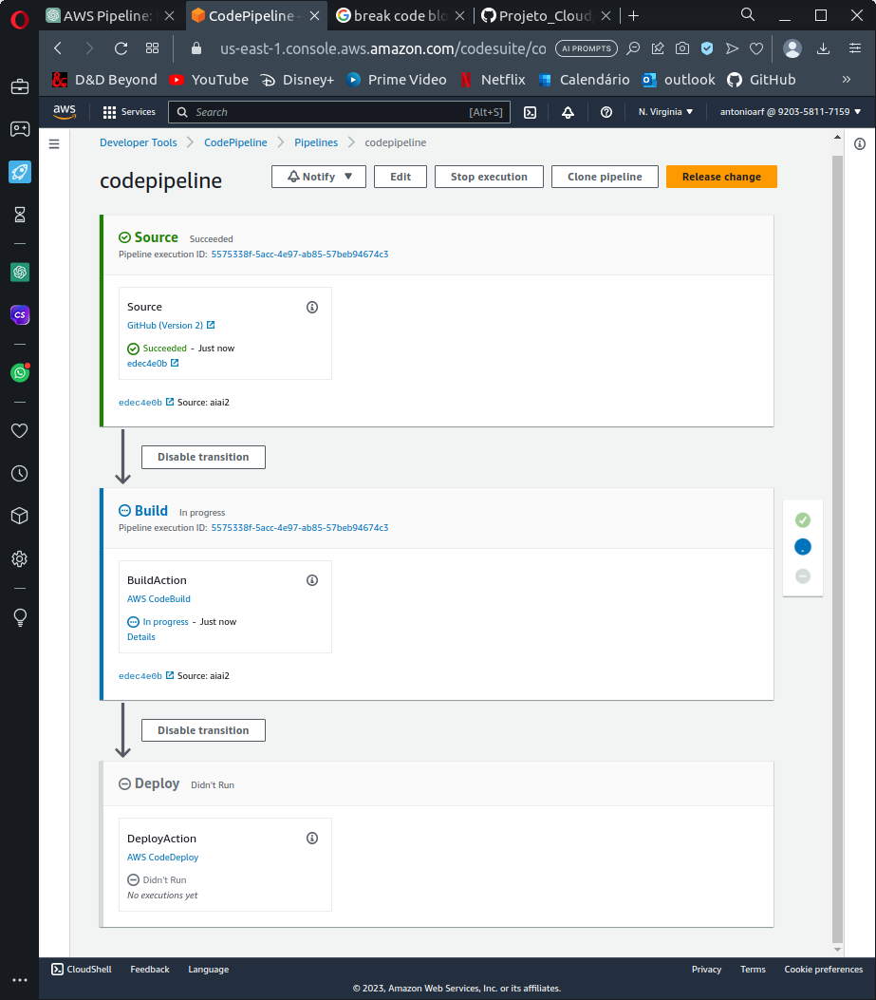
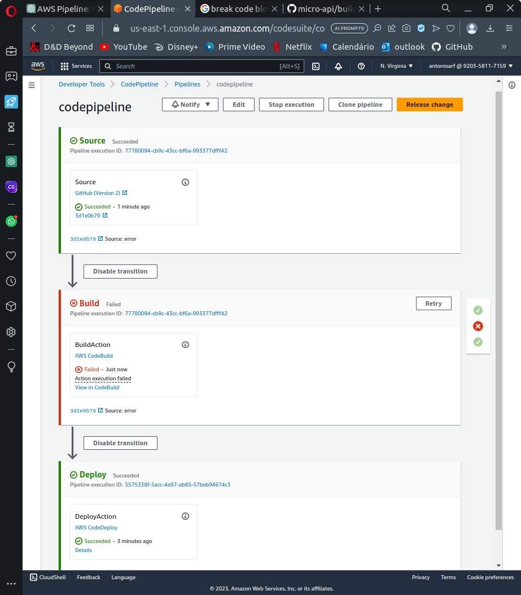
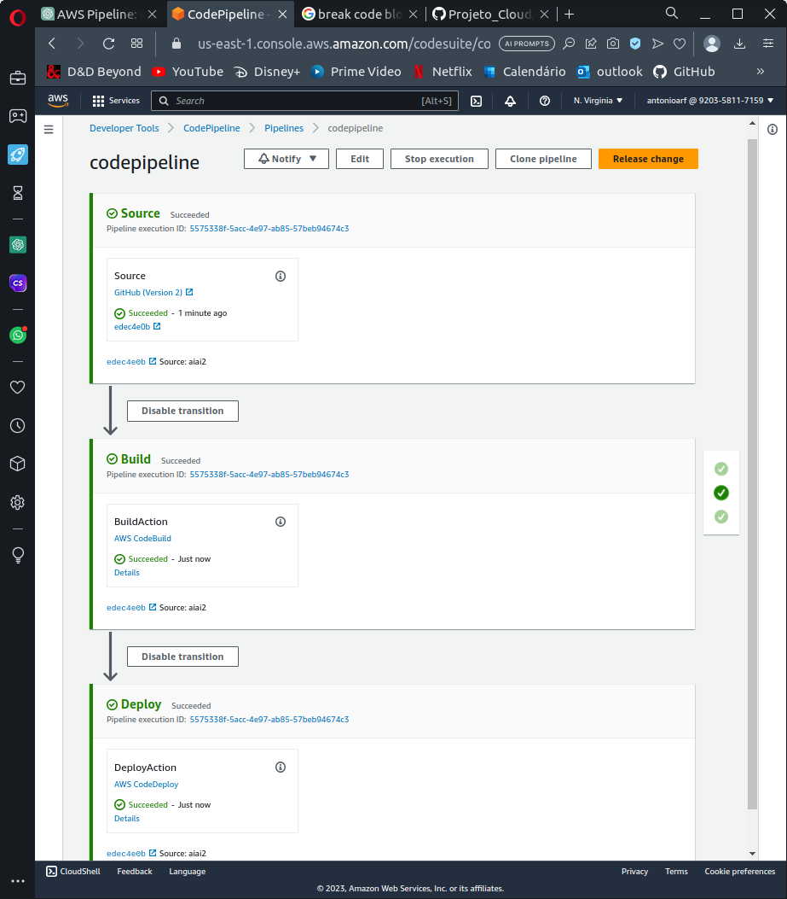

# Pipeline Ci/Cd

### O projeto

Tomou-se como objetivo para o projeto o desenvolvimento de um codigo [Terraform](https://www.terraform.io) objetivando a criação de infraestrutura na [AWS](https://aws.amazon.com) a partir de um repositório [Github](https://github.com) para contínuas atualizações em uma ou mais instâncias [EC2](https://aws.amazon.com/ec2/) hosteadas na mesma região.

O Pipeline proposto é composto de 3 fases: *Source, Build* e *Deploy.*

O Source se comunica com o repositório github, e quando disparado, coleta o repositório e salva em uma instância S3, dando início ao Build,

O Build executa um container para testes e compilação conforme descrito em um arquivo, salvando apenas os dados interessantes de volta no S3 Bucket e acionando o Deploy.

O Deploy por sua vez, acessa a saída da etapa anterior, executa outro arquivo, mas agora alterando a maquina EC2, que é o alvo final do Pipeline.

Existem templates tanto para o arquivo lido pelo CodeBuild como pelo CodeDeploy. Ambos apenas recebem os arquivos da fase anterior e passam à distância, o build salvando na S3 e o deploy diretamente na instância,e mais explicações nas respectivas secções na explicação sobre as dependencias do Pipeline.

### Infraestrutura necessaria

<aside>
💡 Dica: não se esqueça de proteger suas chaves, nunca escreva elas em nenhum arquivo, nem faça upload para o Github

</aside>

Para a execução desse projeto é necessario ter já installado o Terraform no dispositivo onde se deseja utilizar script. Tambem é preciso uma conta no Github com acesso ao repositorio que será implementado no pipeline, tal qual acesso de administrador na conta da AWS para poder fazer a gestão das politicas e papéis envolvidos na implementação.

A explicação do projeto ficou separada em 3 partes, uma tratando das politicas de segurança e autorizações necessarias, a segunda sobre dependencias e intancias necessarias para o projeto e, por ultimo, o pipeline em si e as conexões entre as diferentes intancias. Cada segmento esta registrado em um documento diferente listado abaixo.

## Execução:

Terraform plan #para garantir a compilação e debugar

Terraform apply #para subir e criar os componentes na AWS

Terraform destroy #para limpar apagar ou desativar componentes criados no comando anterior 

# Implementação

[Pipeline](Pipeline.md)

[Dependencias](Dependencias.md)

[Permições](Permicoes.md)

## DashBoard

A AWS oferece também seu dashboard para a interação com seus produtos, é interessante seu uso para acompanhar a implementação e entender possiveis modificaçãoes a serem feitas no codigo.

